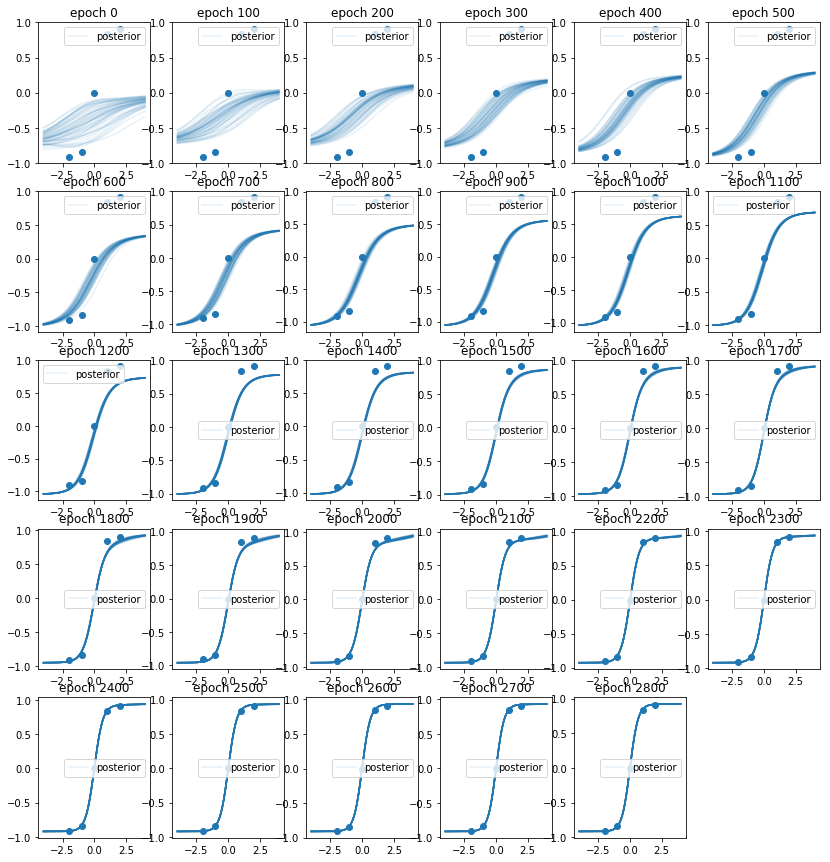
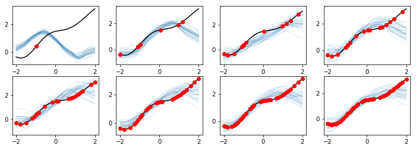

# Neural Processes implemented with Chainer
Implemenation of [Neural Processes](https://arxiv.org/pdf/1807.01622) (NPs) introduced by Garnelo et al. (DeepMind) with [Chainer](https://chainer.org/). NPs can be seen as generalizations of recently published [generative query networks (GQN)](http://science.sciencemag.org/content/360/6394/1204.full) from DeepMind (Eslami and Rezende et al., Science 2018). NPs is a class of neural latent variable models, which can be considered as a combination of Gaussian Process (GP) and neural network (NN). Like GPs, NPs define distributions over functions, are capable of rapid adaptation to new observations, and can estimate the uncertainty in their predictions. Like NNs, NPs are computationally efficient during training and evaluation but also learn to adapt their priors to data.

This is the [blog post (only in Japanese)](http://tk-g.hatenablog.jp/entry/2018/09/02/000000) about this repository.

The experiments and implementation are inspired by [blog post by Kaspar Märtens](https://kasparmartens.rbind.io/post/np/)

MIT license. Contributions welcome.

## Requirements
python 2.x, chainer 4.3.1, numpy, matplotlib

## examples

### Train an NP on a single small data set.
https://github.com/yu-takagi/chainer-neuralprocesses/blob/master/exp_1d_func.ipynb

### Train an NP on repeated draws from the GP.
https://github.com/yu-takagi/chainer-neuralprocesses/blob/master/exp_1d_func_gp_train.ipynb
